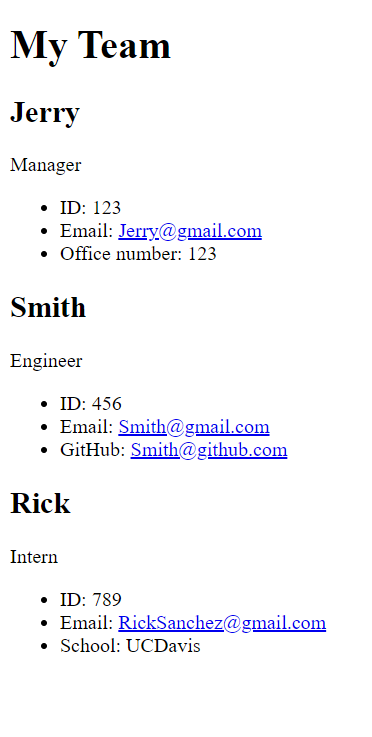

# Team Profile Generator

## Description
 - Application is for creating Profile cards for employees of the company using a few easy steps.
## License 
 - MIT License
## Tech Used
 - Node.js
 - OOP
 - Javascript
## Usage
 - Application that takes in information about employees on a software engineering team and creates a HTML webpage that displays summaries for each person.
## Installation
 - Open terminal
 - Install Inquirer
 - Initiate Node
 - Follow/Answer questions as they pop up
 - Once finished, click I don't want to add any more team members.
 - New HTML page will be created showcasing your new member cards.
 - Open HTML page in browser to view cards.
## Contributors
 - Veroneca Sander
## Challenges
 - 
 - 
## Contact Info
 - Github - @Vtsander
 - Email - nguyenveroneca@yahoo.com
## Photos of Project
 - 